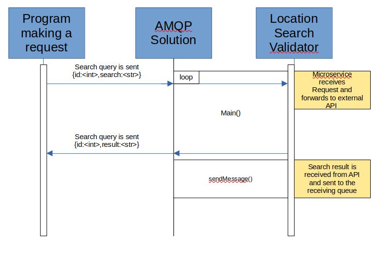

# Location Search Query Validator

How To Use:
- Install Python Packages geopy, pika, and random_address
- Change settings in config.py to configure with your AMQP (i.e. ZeroMQ)
  solution. I used RabbitMQ for testing so YMMV

How it Works:

Requests are sent and received to the microservice via the AMPQ message protocol.
When a request is received it is then sent via a python module called geopy that forwards
the search query to a free service called open maps. If the search query is valid it will return
with a full address. If the search is invalid it will replay with a None response. Each search request
has an associated ID so to not confuse one request with another.

How to programmatically REQUEST data:
- In the config settings the 'queueToSendTo' is the queue that you will
  send the request to in via a string JSON format {id:<int>,query:<str>}

Example Send:
```
import pika,json
credentials = pika.PlainCredentials(config['messageSystem']['user'],config['messageSystem']['password'])
    parameters = pika.ConnectionParameters(host=config['messageSystem']['host'],port=config['messageSystem']['port'],\
    credentials=credentials,virtual_host=config['messageSystem']['virtual_host'])
    connection = pika.BlockingConnection(parameters)
    channel = connection.channel()
    channel.queue_declare(queue=config['messageSystem']['queueToSendTo'])
    channel.basic_publish(exchange='',
    routing_key=config['messageSystem']['queueToSendTo'],
    body=json.dumps({'id':messageID,'searchQuery':body}))
```

How to programmatically RECEIVE data
- In the config settings the 'queueToReceiveFrom' is the queue that will receive
  the query result in via a string JSON format {id:<int>,result:<str>}
  
Example Receive:
```
credentials = pika.PlainCredentials(config['messageSystem']['user'],config['messageSystem']['password'])
parameters = pika.ConnectionParameters(host=config['messageSystem']['host'],port=config['messageSystem']['port'],\
                                       credentials=credentials,virtual_host=config['messageSystem']['virtual_host'])
connection = pika.BlockingConnection(parameters)
channel = connection.channel()
channel.queue_declare(queue=config['messageSystem']['queueToReceiveFrom'])
def callback(ch, method, properties, body):
        print(body)
        time.sleep(2)
channel.basic_consume(queue=config['messageSystem']['queueToReceiveFrom'], on_message_callback=callback, auto_ack=True)
channel.start_consuming()
```

  
UML Diagram of Application Flow:

